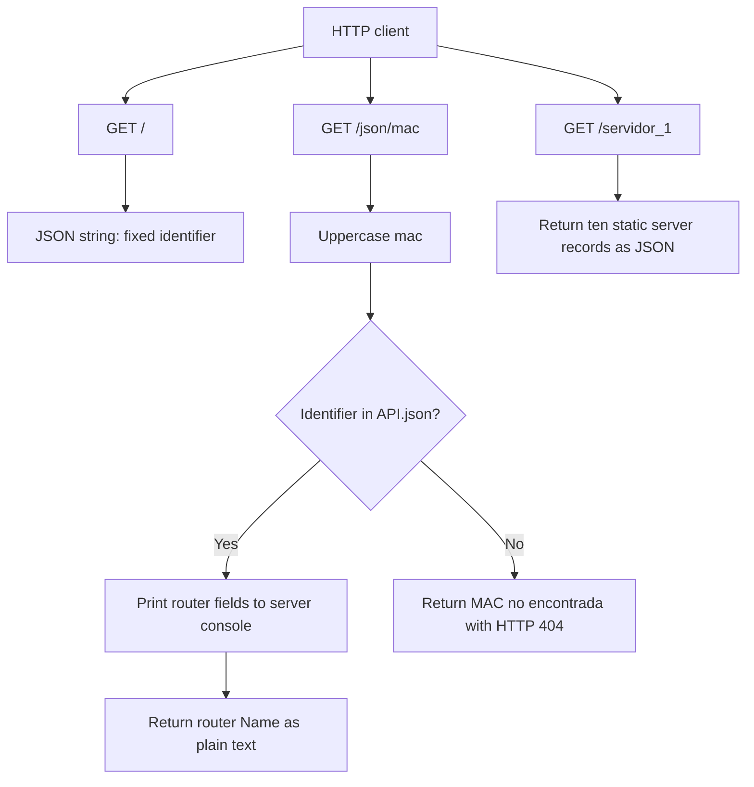

# Flask Network API

Small Flask application that exposes sample network-device data and a static server inventory. This README records the current behavior as a reference for future development.

## Project Structure

| Path | Purpose |
| --- | --- |
| `app.py` | Flask application and its HTTP routes. |
| `API.json` | Router records indexed by MAC-like identifiers. |
| `Unidad1/` | Python exercises and class activities. |
| `Unidad2/` | Presently empty. |
| `req.txt`, `req.tx` | Presently empty; neither file declares dependencies. |

The virtual environment (`venv/`) is local and should not be committed.

## Run Locally

From the project root, install Flask in the active Python environment and start the development server:

```powershell
python -m pip install Flask
python app.py
```

The server runs with Flask debug mode enabled and is available at `http://127.0.0.1:5000`. Run the app from the project root because `API.json` is opened using a relative path. Debug mode is intended for local development only.

## Routes

All routes currently use Flask's default `GET` method.

| Method | URL | Behavior |
| --- | --- | --- |
| `GET` | `/` | Returns the JSON string `"3D:RF:09:7F::"`. This is a fixed identifier and does not look up a router. |
| `GET` | `/json/<mac>` | Uppercases the supplied path value, looks it up in `API.json`, prints the router's name, protocols, status, and VLANs to the server console, then returns the router `Name` as plain text. A missing identifier returns `MAC no encontrada` with HTTP `404`. |
| `GET` | `/servidor_1` | Returns a JSON object containing ten static server records, keyed from `0001` through `0010`. |

### Example URLs

- Home: `http://127.0.0.1:5000/`
- Router `R0`: `http://127.0.0.1:5000/json/3D:RF:09:7F:00:00`
- Unknown router (404): `http://127.0.0.1:5000/json/unknown`
- Server inventory: `http://127.0.0.1:5000/servidor_1`

### Router Data

`API.json` is a top-level object keyed by MAC-like identifiers. Each router record contains `Name`, `Protocolos`, `estatus`, and `VLANs`. VLAN records may contain `Ports`, `Policies`, `ET`, `IP`, and `SSH`. The lookup is case-insensitive because the route converts the requested identifier to uppercase before searching. The returned success body is currently only the router name; the other fields are printed to the application console rather than returned to the caller.

### Server Inventory

`GET /servidor_1` returns a JSON object whose keys are server IDs and whose values contain `nombre`, `ip`, `politica`, and `estado`.

| ID | Name | IP | Policy | Status |
| --- | --- | --- | --- | --- |
| `0001` | `Servidor-Web-01` | `192.168.1.50` | `Permitir-HTTP-HTTPS` | `Activo` |
| `0002` | `BaseDeDatos-Master` | `192.168.1.51` | `Solo-Acceso-Interno` | `Activo` |
| `0003` | `Servidor-Archivos-01` | `192.168.1.52` | `Solo-Acceso-Interno` | `Activo` |
| `0004` | `Servidor-DNS-01` | `192.168.1.53` | `DNS-UDP-TCP` | `Activo` |
| `0005` | `Servidor-Aplicaciones-01` | `192.168.1.54` | `Permitir-HTTP-HTTPS` | `Activo` |
| `0006` | `Servidor-Backup-01` | `192.168.1.55` | `Solo-Acceso-Interno` | `Activo` |
| `0007` | `Servidor-Monitoreo-01` | `192.168.1.56` | `Solo-Acceso-Interno` | `Activo` |
| `0008` | `Servidor-Correo-01` | `192.168.1.57` | `Permitir-SMTP-IMAP` | `Activo` |
| `0009` | `Servidor-Proxy-01` | `192.168.1.58` | `Filtrado-Web` | `Activo` |
| `0010` | `Servidor-Desarrollo-01` | `192.168.1.59` | `Acceso-Desarrollo` | `Activo` |

## Route Map



## Git Branches

At the time of initial setup, the checked-out local branch was `feature/FlaskV01`; the GitHub target was the existing `release` branch with one starter README commit. That remote history is retained when publishing this project to `release`.
